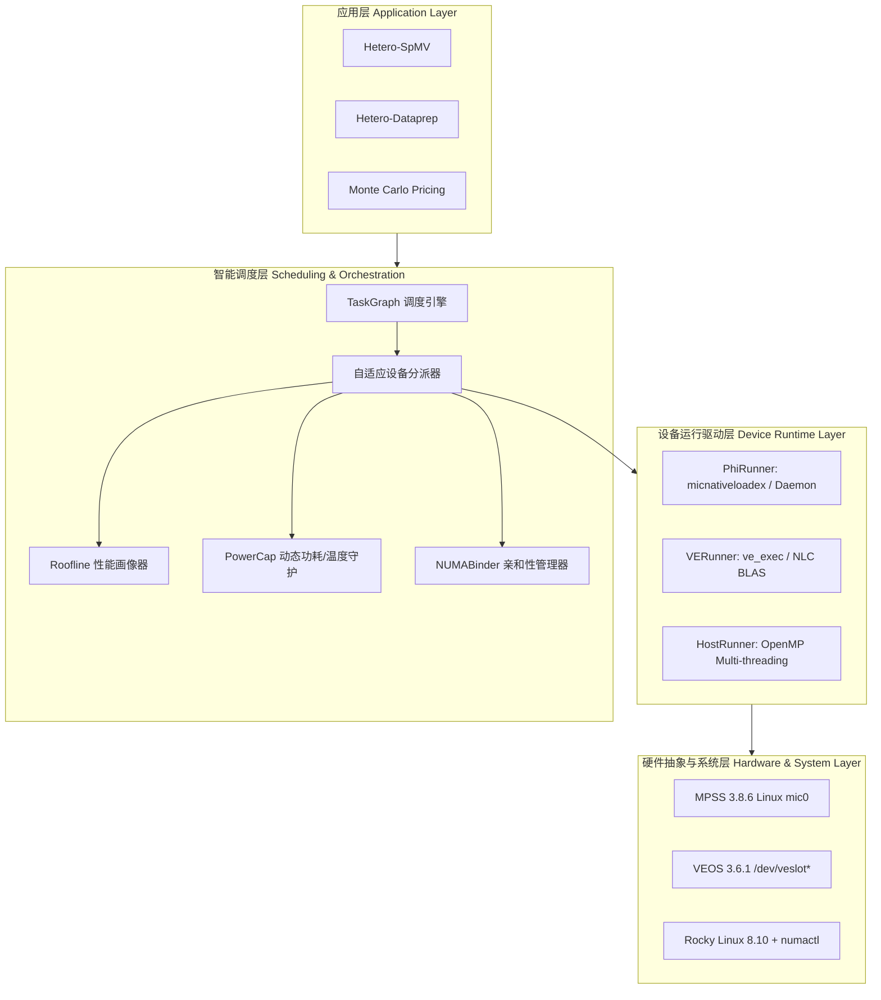

# Uni 异构计算系统分层架构设计规范 (System Architecture Spec)

> 版本: V2.0  
> 日期: 2026-09-03  
> 责任 Agent: Antigravity  

---

## 1. 总体硬件与拓扑抽象

```
                ┌─────────────────────────────────────────┐
                │          ASUS ESC4000 G4 Server         │
                │        2× Intel Xeon Gold 6252          │
                │             (48C/96T, 192GB)            │
                └──────────────┬───────────────────┬──────┘
                               │                   │
                     NUMA Node 0 (CPU 0)   NUMA Node 1 (CPU 1)
                               │                   │
                 ┌─────────────┴─────┐      ┌──────┴─────────────┐
                 │                   │      │                    │
              PCIe Slot 1         PCIe Slot 2   PCIe Slot 3   PCIe Slot 4
                 │                   │      │                    │
          Intel Xeon Phi          NEC VE 0  │      NEC VE 1      NEC VE 2
          7120P (Knights Corner)  (Type 10BE)      (Type 10BE)   (Type 10B)
          61 Cores / 16GB GDDR5   8 Vec Cores      8 Vec Cores   8 Vec Cores
          Passive Cooling (300W)  48GB HBM2        48GB HBM2     48GB HBM2
```

---

## 2. 软件调度分层 (Software Stack Layers)



---

## 3. 各模块接口与责任边界

1. **TaskGraph (`src/scheduler/task_graph.py`)**：
   - 负责任务 DAG 的拓扑解析、就绪队列维护、并行协程生命周期控制与错误熔断。
2. **Profiler (`src/scheduler/profiler.py`)**：
   - 基于实测校准的 Roofline 模型对算子的 FLOP/Byte 进行计算，预估各设备运行开销，为调度提供决策支撑。
3. **PowerCap (`src/scheduler/power.py`)**：
   - 维护 1440W 安全动态功耗预算，防止整机瞬时负载超出 1600W PSU 阈值，实施排队等待。
4. **NUMABinder (`src/scheduler/numa.py`)**：
   - 自动绑定进程至 Slot 对应的 NUMA Socket（Phi/VE0 对应 NUMA0，VE1/VE2 对应 NUMA1），消除跨 Socket UPI 总线带宽损耗。
